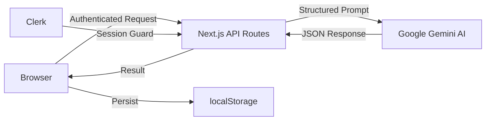

<h1 align="center">Signl</h1>

<p align="center">
  <strong>The AI-powered career intelligence platform that turns job rejections into actionable data.</strong>
</p>

<p align="center">
  <a href="#features">Features</a> •
  <a href="#tech-stack">Tech Stack</a> •
  <a href="#getting-started">Getting Started</a> •
  <a href="#project-structure">Project Structure</a> •
  <a href="#architecture">Architecture</a> •
  <a href="#environment-variables">Environment</a> •
  <a href="#contributing">Contributing</a> •
  <a href="#license">License</a>
</p>

---

## Overview

**Signl** is a full-stack Next.js application designed for job seekers who want to approach their career transition with precision, not volume. Instead of blindly mass-applying, Signl uses **Google Gemini AI** to analyze resumes against job descriptions, conduct AI-powered mock interviews, match users with relevant job listings, and provide real-time market intelligence — all within a sleek, premium interface.

> *"Turn rejections into data."*

---

## Features

### 📊 Resume Analyser
Upload your resume (PDF or DOCX) alongside a job description. Signl's AI engine performs a deep gap analysis — scoring your match, identifying missing skills, and providing a personalized coaching insight.

### 🔍 Job Matcher
Discover high-intent job listings matched to your resume profile. Signl aggregates results across LinkedIn, Indeed, Glassdoor, Wellfound, Naukri, and niche startup boards.

### 🎤 Voice Interview Coach
Practice interviews using your voice. Speak naturally with an AI interviewer and receive real-time feedback on your tone, pacing, and answer quality.

### 🧠 Interview Lab
A text-based mock interview system. Get AI-generated questions tailored to a specific company and role, submit your answers, and receive STAR-method feedback with scored evaluations (1–10).

### 💬 Live Sandbox
Full conversational mock interviews with AI personas simulating real hiring managers. Includes a multi-stage **Full Pipeline** mode (Phone Screen → Technical → Behavioral → Debrief).

### ✉️ Cover Letter Generator
Automatically drafts professional cover letters and cold outreach emails by synthesizing your resume highlights with the target job's requirements.

### 📈 Market Benchmarks
FAANG-level salary, demand, and competition data for your target roles. Powered by AI-generated insights based on current market trends.

### 🧬 Communication DNA
Analyzes your writing and speaking patterns to build a unique communication profile — identifying your strengths, weaknesses, and areas for improvement.

### 📋 Application Pipeline
A Kanban-style tracker for all your job applications. Log new applications, track their stage (Applied → Phone Screen → Onsite → Offer/Rejected), and visualize your pipeline funnel.

### ⚙️ Settings & Billing
User preferences, centralized resume management, dark/light theme toggle, and a tiered billing system (Free / Pro / Team) with feature-gated usage limits.

---

## Tech Stack

| Layer | Technology |
| :--- | :--- |
| **Framework** | [Next.js 16](https://nextjs.org/) (App Router) |
| **Language** | JavaScript (React 19), TypeScript config |
| **Styling** | [Tailwind CSS 4](https://tailwindcss.com/) + Custom CSS Design System |
| **AI Engine** | [Google Gemini API](https://ai.google.dev/) (`gemini-2.5-flash` w/ auto-fallback chain) |
| **Authentication** | [Clerk](https://clerk.com/) (Session-based, middleware-protected) |
| **Animations** | [Framer Motion](https://www.framer.com/motion/) |
| **Icons** | [Lucide React](https://lucide.dev/) |
| **Charts** | [Recharts](https://recharts.org/) |
| **Document Parsing** | [mammoth](https://github.com/mwilliamson/mammoth.js) (DOCX), [pdf-parse](https://www.npmjs.com/package/pdf-parse) (PDF) |
| **Code Editor** | [Monaco Editor](https://microsoft.github.io/monaco-editor/) (for resume tailoring preview) |
| **State** | Browser `localStorage` (user-namespaced via Clerk ID) |
| **Rate Limiting** | Custom in-memory sliding-window (6 req/min per IP) |
| **Caching** | [lru-cache](https://www.npmjs.com/package/lru-cache) |

---

## Getting Started

### Prerequisites

- **Node.js** ≥ 18.x
- **npm** ≥ 9.x (or pnpm / yarn)
- A [Google AI Studio](https://aistudio.google.com/apikey) API key
- A [Clerk](https://dashboard.clerk.com/) project (publishable + secret keys)

### Installation

```bash
# 1. Clone the repository
git clone https://github.com/RISHIE2006/Signl.git
cd Signl

# 2. Install dependencies
npm install

# 3. Set up environment variables
cp .env.local.example .env.local
# Then edit .env.local with your actual keys (see below)

# 4. Run the development server
npm run dev
```

Open [http://localhost:3000](http://localhost:3000) in your browser.

---

## Environment Variables

Create a `.env.local` file in the project root with the following keys:

```env
# Clerk Authentication
NEXT_PUBLIC_CLERK_PUBLISHABLE_KEY=pk_test_...
CLERK_SECRET_KEY=sk_test_...
NEXT_PUBLIC_CLERK_SIGN_IN_URL=/sign-in
NEXT_PUBLIC_CLERK_SIGN_UP_URL=/sign-up

# Google Gemini AI
GEMINI_API_KEY=your_gemini_api_key_here
```

> **Note:** Never commit your `.env.local` file. It is already listed in `.gitignore`.

---

## Project Structure

```
signl/
├── app/                          # Next.js App Router pages
│   ├── api/                      # Server-side API routes
│   │   ├── analyse/              #   Resume analysis endpoint
│   │   ├── benchmarks/           #   Market data generation
│   │   ├── cover-letter/         #   Cover letter / outreach drafting
│   │   ├── debrief/              #   Post-interview debrief AI
│   │   ├── extract-text/         #   PDF/DOCX text extraction
│   │   ├── feedback/             #   Interview answer evaluation
│   │   ├── insight/              #   AI coaching insights
│   │   ├── jobs/                 #   Job matching engine
│   │   ├── learning-path/        #   Skill gap study plans
│   │   ├── prep/                 #   Interview question generation
│   │   ├── simulation/           #   Full mock interview chat
│   │   ├── tailor/               #   Resume tailoring suggestions
│   │   └── turbo/                #   Fast-track analysis mode
│   ├── analyse/                  # Resume Analyser page
│   ├── applications/             # Application pipeline tracker
│   ├── benchmarks/               # Market benchmarks page
│   ├── billing/                  # Subscription & billing page
│   ├── cover-letter/             # Cover letter generator page
│   ├── dashboard/                # Main dashboard
│   ├── dna/                      # Communication DNA page
│   ├── jobs/                     # Job matcher page
│   ├── log/                      # Log new application page
│   ├── onboarding/               # New user onboarding flow
│   ├── prep/                     # Interview lab page
│   ├── prep-voice/               # Voice interview coach page
│   ├── settings/                 # User preferences page
│   ├── sign-in/                  # Clerk sign-in page
│   ├── sign-up/                  # Clerk sign-up page
│   ├── simulation/               # Live sandbox + pipeline pages
│   ├── globals.css               # Global design system & tokens
│   ├── layout.js                 # Root layout (Clerk, Theme, Fonts)
│   └── page.js                   # Landing page (marketing site)
├── src/
│   ├── components/               # Shared React components
│   │   ├── Sidebar.js            #   Navigation sidebar
│   │   ├── ResumeManager.js      #   Centralized resume upload/management
│   │   ├── TailoredResumePreview.js  # Monaco-based resume preview
│   │   ├── CompanyAutocomplete.js    # Company name autocomplete
│   │   ├── DebriefSection.tsx    #   Post-interview debrief card
│   │   ├── ThemeProvider.jsx     #   Dark/light mode context
│   │   ├── ThemeToggle.jsx       #   Theme switch button
│   │   ├── PageAnimate.jsx       #   Page transition wrapper
│   │   ├── Loader.jsx            #   Loading spinner
│   │   └── LoadingButton.jsx     #   Button with loading state
│   ├── hooks/
│   │   └── useBilling.js         #   Billing & usage limit hook
│   └── lib/
│       ├── gemini.js             #   Gemini API client (w/ fallback chain)
│       ├── store.js              #   localStorage state management
│       ├── ratelimit.js          #   In-memory rate limiter
│       └── json-utils.js         #   Robust LLM JSON parser
├── middleware.js                  # Clerk auth + rate limiting middleware
├── tests/                        # Test files
├── scripts/                      # Utility scripts
├── public/                       # Static assets (logos, demo images)
├── package.json
├── next.config.ts
├── tsconfig.json
└── architecture.md               # Detailed architecture documentation
```

---

## Architecture

Signl follows a clean **client → API route → AI service** pattern:



### Key Design Decisions

1. **AI Model Fallback Chain** — Gemini calls cycle through 5 models (`gemini-2.5-flash` → `gemini-2.5-pro` → `gemini-2.0-flash` → `gemini-3-flash-preview` → `gemini-3.1-pro-preview`) for maximum uptime.

2. **Client-Side Persistence** — All user data is stored in `localStorage`, namespaced by Clerk user ID (`signl_{userId}_{dataType}`). This eliminates the need for a traditional database while keeping data isolated between users.

3. **Rate Limiting** — A sliding-window rate limiter (6 requests/minute per IP) runs in Next.js middleware to prevent API abuse.

4. **Robust JSON Parsing** — LLM responses are parsed through a custom utility that strips markdown code blocks, fixes trailing commas, and extracts JSON from mixed text.

For the full architecture deep-dive including sequence diagrams, see [architecture.md](architecture.md).

---

## Available Scripts

| Command | Description |
| :--- | :--- |
| `npm run dev` | Start the development server on `localhost:3000` |
| `npm run build` | Create an optimized production build |
| `npm run start` | Serve the production build |
| `npm run lint` | Run ESLint across the codebase |

---

## API Endpoints

All API routes are server-side Next.js Route Handlers, protected by Clerk authentication middleware.

| Method | Endpoint | Description |
| :--- | :--- | :--- |
| `POST` | `/api/analyse` | Analyze resume against a job description |
| `POST` | `/api/extract-text` | Extract text from PDF/DOCX uploads |
| `POST` | `/api/cover-letter` | Generate cover letter / cold email |
| `POST` | `/api/feedback` | Evaluate interview answer (STAR method) |
| `POST` | `/api/prep` | Generate interview questions for a role |
| `POST` | `/api/simulation` | Conversational mock interview |
| `POST` | `/api/debrief` | Post-interview AI debrief |
| `POST` | `/api/benchmarks` | Generate market benchmark data |
| `POST` | `/api/jobs` | Find matching job listings |
| `POST` | `/api/learning-path` | Create skill gap study plan |
| `POST` | `/api/tailor` | Generate tailored resume suggestions |
| `POST` | `/api/insight` | AI coaching insight generation |
| `POST` | `/api/turbo` | Fast-track analysis mode |

---

## Contributing

Contributions are welcome! Please see [CONTRIBUTING.md](CONTRIBUTING.md) for guidelines.

---

## License

This project is licensed under the **MIT License** — see the [LICENSE](LICENSE) file for details.

---

<p align="center">
  <sub>Built with ☕ and AI by <a href="https://github.com/RISHIE2006">Rishie</a></sub>
</p>
