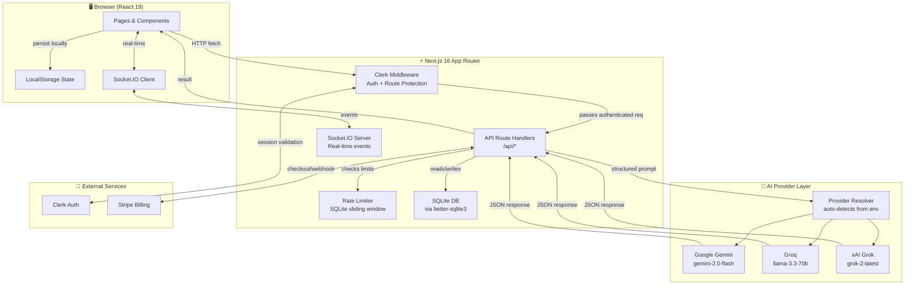
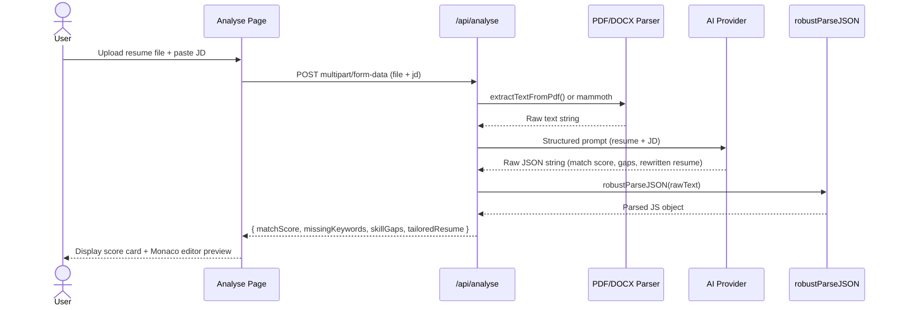
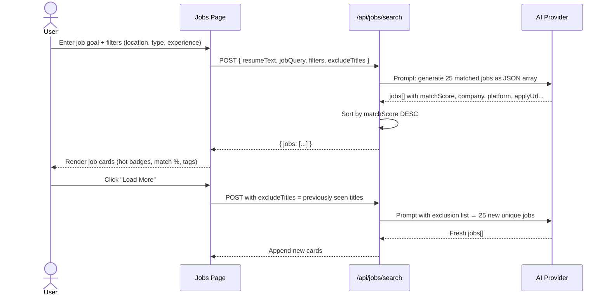
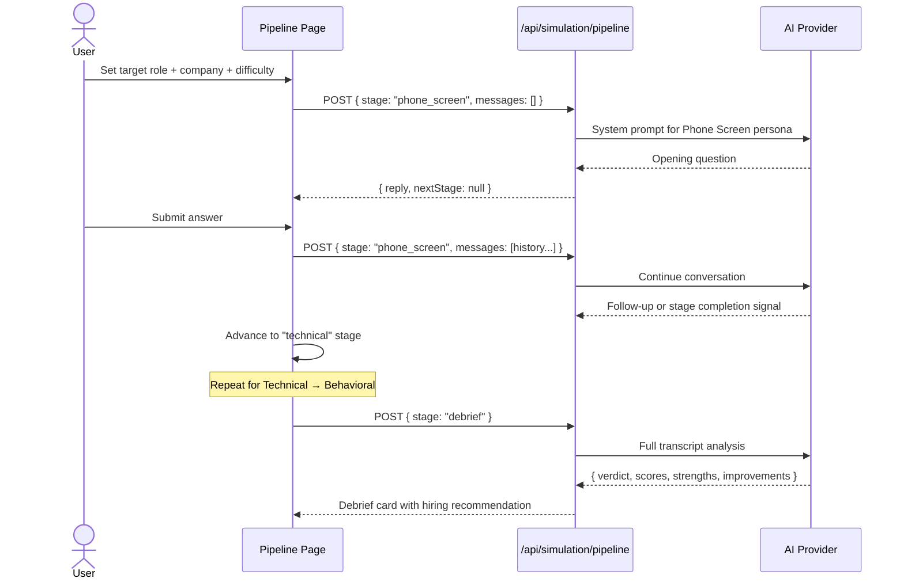
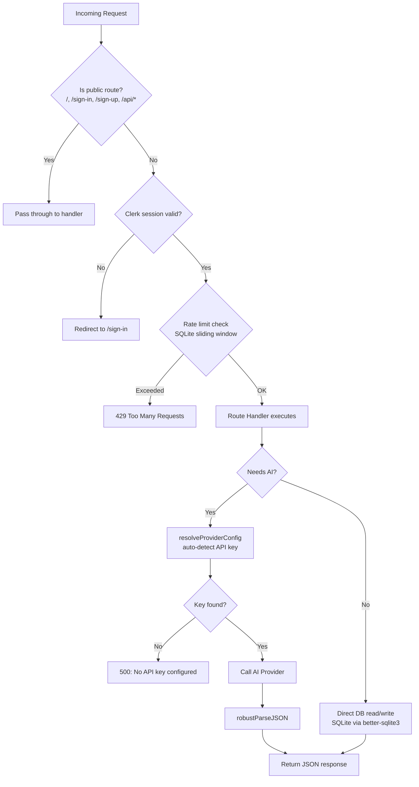
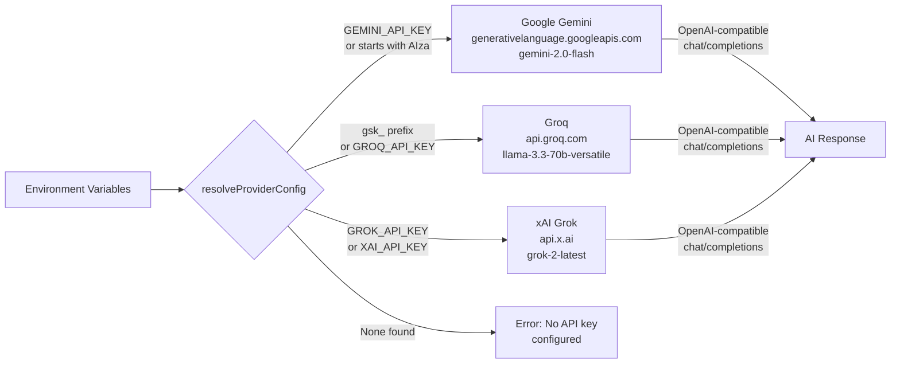
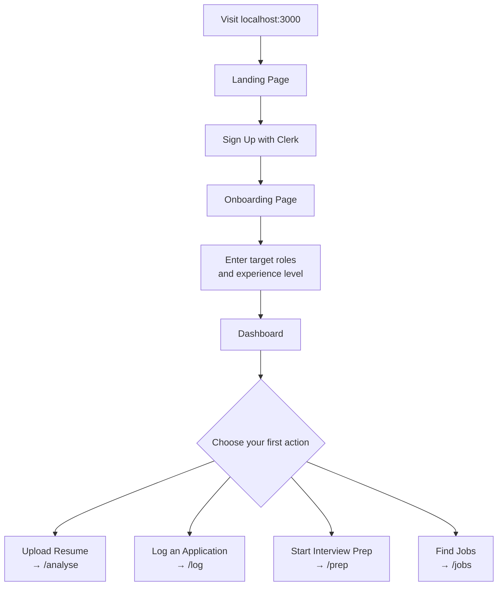

<h1 align="center">
  <br/>
  Signl
</h1>

<p align="center">
  <strong>The AI-powered career intelligence platform that turns job rejections into actionable data.</strong><br/>
  <sub>Stop mass-applying. Start winning with precision.</sub>
</p>

<p align="center">
  
  
  
  
  
  
</p>

<p align="center">
  <a href="#-what-is-signl">What is Signl?</a> •
  <a href="#-features">Features</a> •
  <a href="#-architecture">Architecture</a> •
  <a href="#-data-flow-diagrams">Data Flows</a> •
  <a href="#-tech-stack">Tech Stack</a> •
  <a href="#-getting-started">Getting Started</a> •
  <a href="#-api-reference">API Reference</a> •
  <a href="#-project-structure">Structure</a> •
  <a href="#-environment-variables">Environment</a>
</p>

---

## 🎯 What is Signl?

Most job seekers spray-and-pray — sending hundreds of identical applications and wondering why they hear nothing back. **Signl** flips this model entirely.

Signl is a **full-stack AI career intelligence platform** built on Next.js 16. It gives job seekers the same systematic, data-driven edge that top recruiters use — without needing a career coach, a premium LinkedIn subscription, or connections at the company.

> *"Turn rejections into data."*

### The Core Philosophy

```
❌ Old way:  Apply → Reject → Repeat (with no idea why)
✅ Signl:    Apply → Analyse → Learn → Improve → Win
```

Every tool in Signl is designed around a single insight: **rejection data is signal, not noise**. By analyzing your resume gaps, simulating real interviews, benchmarking your skills against the market, and tracking your pipeline — Signl helps you see exactly where you're losing and how to fix it.

---

## ✨ Features

### 📊 Resume Analyser
Upload your resume (PDF or DOCX) and paste a job description. Signl's AI engine performs a deep, structured gap analysis:
- **Match Score** (0–100) showing overall fit
- **Missing Keywords** the ATS and recruiter expect to see
- **Skill Gaps** with actionable suggestions
- **Coach Insight** — a 2–3 sentence personalized recommendation
- **Tailored Resume** — a fully rewritten resume optimized for the specific JD, with STAR-method bullet points

### 🔍 Job Matcher
Describe your target role and goals. Signl generates 25 realistic, highly-matched job listings aggregated across LinkedIn, Indeed, Glassdoor, Wellfound, Naukri, and Greenhouse:
- Per-job **Match Score** with reasoning
- **Missing Skills** breakdown per role
- **Platform** and direct apply URL
- Filter by location, type (Full-time / Internship / Contract), and experience level
- **"Load More"** fetches 25 fresh roles (deduplicates against seen titles)

### 🎤 Voice Interview Coach
Practice interviews hands-free using your microphone. Speak your answer naturally and receive:
- Real-time transcription via the browser's Web Speech API
- AI evaluation of your response against the question
- Feedback on completeness, STAR method usage, and tone

### 🧠 Interview Lab
Text-based mock interview system with deep evaluation:
- AI generates role-specific questions (technical, behavioral, situational)
- Submit answers and receive STAR-format feedback scored 1–10
- Tracks score history across sessions
- Supports company-specific interview style customization

### 💬 Live Sandbox
Full conversational mock interview with an AI hiring manager persona:
- Choose role, company, difficulty, and tone (friendly / tough / stress-test)
- Maintains full conversation history for realistic multi-turn dialogue
- Available in text and voice modes

### 🔁 Full Pipeline Simulation
A structured, multi-stage interview simulator:

```
Phone Screen → Technical Round → Behavioral → Final Debrief
```

Each stage gates to the next only after completion. The final Debrief stage generates a complete performance analysis including scores, strengths, weaknesses, and a hiring recommendation verdict.

### ✉️ Cover Letter & Cold Email Generator
Generate polished, role-specific cover letters and cold outreach emails:
- Synthesizes resume highlights with job requirements
- Supports different tones (formal, startup-casual, creative)
- One-click copy and download

### 📈 Market Benchmarks
AI-generated, role-aware hiring market intelligence:
- Offer rate from total applications (industry average)
- Resume drop-off rate by sector (Top Tech, Startups, Consulting, Finance)
- Technical stage drop-off percentages
- Falls back to curated offline data if AI is unavailable

### 🧬 Communication DNA
Analyze your writing and communication patterns to build a unique profile:
- Identifies linguistic strengths and weaknesses
- Tracks vocabulary complexity, sentence clarity, and persuasion style
- Generates improvement recommendations

### 📋 Application Pipeline Tracker
Kanban-style application management:
- Log applications with company, role, date, notes, and salary
- Track status: Applied → HR Screen → Technical → Final Round → Offer / Rejected
- View your funnel drop-off visually on the dashboard
- Edit and delete entries

### ⚡ AI Coach Insight
The dashboard surfaces a real-time AI pattern analysis of your application history — identifying trends in why you're progressing or stalling at certain stages.

### ⚙️ Settings & Billing
- Upload and manage a master resume (used as context across all AI tools)
- Dark / Light theme toggle
- Tiered plan system: **Free**, **Pro**, **Team**
- Stripe-powered subscription checkout and portal

---

## 🏗 Architecture

Signl follows a clean **multi-layer architecture** separating concerns between the client, API layer, AI provider, and persistence.



### Key Design Decisions

#### 1. Multi-Provider AI with Auto-Detection
The `grok.js` module automatically selects the AI provider by inspecting available environment keys — no configuration required. Priority order: Gemini → Groq → xAI. This means the app works with any of the three APIs interchangeably.

#### 2. Dual Persistence Strategy
- **SQLite** (`better-sqlite3`) is used server-side for structured data (applications, analyses, preps, profile) that needs to persist across devices
- **localStorage** is the client-side fallback, namespaced per Clerk user ID (`signl_{userId}_{dataType}`)

#### 3. Rate Limiting
A custom SQLite-backed sliding-window rate limiter protects all AI routes (10 req/sec) and DB routes (60 req/sec) from abuse without requiring Redis or an external service.

#### 4. Robust JSON Parsing
LLM responses are processed through a bracket-counting parser (`json-utils.js`) that handles markdown fences, trailing commas, partial responses, and malformed output — making AI features resilient to model inconsistencies.

#### 5. Real-Time with Socket.IO
A custom HTTP server (`server.js`) wraps Next.js and layers Socket.IO on top, enabling real-time application update events, notifications, and presence — all while keeping the standard Next.js dev/prod workflow intact.

---

## 🔄 Data Flow Diagrams

### Resume Analysis Flow



### Job Matching Flow



### Full Pipeline Simulation Flow



### Authentication & Request Guard Flow



### AI Provider Resolution Logic



---

## 🛠 Tech Stack

| Layer | Technology | Purpose |
| :--- | :--- | :--- |
| **Framework** | [Next.js 16](https://nextjs.org/) (App Router) | Full-stack React framework |
| **Language** | JavaScript (React 19) + TypeScript config | Application logic |
| **Styling** | Tailwind CSS 4 + Custom CSS Design System | UI tokens, dark/light themes |
| **AI Engine** | Gemini / Groq / xAI (auto-detected) | All generative AI features |
| **Auth** | [Clerk](https://clerk.com/) | User sessions, middleware guard |
| **Database** | [better-sqlite3](https://github.com/WiseLibs/better-sqlite3) | Server-side persistent storage |
| **Real-time** | [Socket.IO](https://socket.io/) | Live application events |
| **Animations** | [Framer Motion](https://www.framer.com/motion/) | Page transitions, micro-animations |
| **Icons** | [Lucide React](https://lucide.dev/) | Consistent icon set |
| **Charts** | [Recharts](https://recharts.org/) | Market benchmark visualizations |
| **3D** | [React Three Fiber](https://r3f.docs.pmnd.rs/) + Three.js | 3D visual elements |
| **PDF Parsing** | [pdf-parse](https://www.npmjs.com/package/pdf-parse) | Extract text from PDF resumes |
| **DOCX Parsing** | [mammoth](https://github.com/mwilliamson/mammoth.js) | Extract text from Word resumes |
| **Code Editor** | [Monaco Editor](https://microsoft.github.io/monaco-editor/) | Tailored resume preview |
| **Payments** | [Stripe](https://stripe.com/) | Pro/Team subscription billing |
| **Rate Limiting** | Custom SQLite sliding-window | Abuse prevention on AI routes |
| **Caching** | [lru-cache](https://www.npmjs.com/package/lru-cache) | In-memory response caching |
| **Deployment** | [Vercel](https://vercel.com/) | Edge-optimized production hosting |

---

## 🚀 Getting Started

### Prerequisites

- **Node.js** ≥ 18.x
- **npm** ≥ 9.x
- At least **one** AI API key: [Gemini](https://aistudio.google.com/), [Groq](https://console.groq.com/), or [xAI](https://console.x.ai/)
- A [Clerk](https://dashboard.clerk.com/) project (publishable + secret keys)

### Installation

```bash
# 1. Clone the repository
git clone https://github.com/RISHIE2006/Signl.git
cd Signl

# 2. Install dependencies
npm install

# 3. Set up environment variables
cp .env.local.example .env.local
# Edit .env.local with your keys (see Environment Variables section below)

# 4. Start the development server (includes Socket.IO)
npm run dev
```

Open [http://localhost:3000](http://localhost:3000) in your browser.

### First-Time Setup Flow



---

## 📡 API Reference

All API routes are Next.js Route Handlers. The `/api/*` pattern is public in middleware but individual routes perform their own validation.

### AI Routes

| Method | Endpoint | Request Body | Response |
| :--- | :--- | :--- | :--- |
| `POST` | `/api/analyse` | `multipart/form-data` (resumeFile, jd) or `{ resume, jd }` | `{ matchScore, missingKeywords, skillGaps, coachInsight, tailoredResume, resumeText }` |
| `POST` | `/api/extract-text` | `multipart/form-data` (file: PDF or DOCX) | `{ text }` |
| `POST` | `/api/jobs/search` | `{ resumeText, jobQuery, filters, excludeTitles }` | `{ jobs: [...] }` |
| `POST` | `/api/prep` | `{ role, company, type }` | `{ questions: [...] }` |
| `POST` | `/api/feedback` | `{ question, answer, role }` | `{ score, feedback, starAnalysis }` |
| `POST` | `/api/simulation` | `{ messages, role, company, difficulty }` | `{ reply }` |
| `POST` | `/api/simulation/pipeline` | `{ stage, messages, role, company }` | `{ reply, nextStage, debrief? }` |
| `POST` | `/api/debrief` | `{ transcript, role, company }` | `{ verdict, scores, strengths, improvements }` |
| `POST` | `/api/cover-letter` | `{ resume, jd, tone }` | `{ coverLetter, coldEmail }` |
| `GET/POST` | `/api/benchmarks` | `POST: { roles }` | `{ marketAvgSuccessRate, avgTechnicalDropoff, sectors, source }` |
| `POST` | `/api/learning-path` | `{ skillGaps, role }` | `{ plan: [...] }` |
| `POST` | `/api/insight` | `{ applications }` | `{ insight }` |
| `POST` | `/api/tailor` | `{ resume, jd }` | `{ suggestions: [...] }` |

### Database Routes (`/api/db/*`)

| Method | Endpoint | Description |
| :--- | :--- | :--- |
| `GET/POST` | `/api/db/profile` | Read or save user profile |
| `GET/POST` | `/api/db/applications` | List or create applications |
| `GET/PATCH/DELETE` | `/api/db/applications/[id]` | Read, update, or delete one application |
| `GET/POST` | `/api/db/analyses` | List or save resume analyses |
| `GET/POST/DELETE` | `/api/db/preps` | List, save, or delete interview prep sessions |
| `GET/POST` | `/api/db/resume` | Read or save master resume |
| `GET/POST` | `/api/db/benchmarks` | Read or save benchmark data |
| `GET/POST` | `/api/db/dna` | Read or save communication DNA profile |
| `GET/POST` | `/api/db/plan` | Read or update subscription plan |
| `GET` | `/api/db/stats` | Aggregated dashboard statistics |
| `DELETE` | `/api/db/clear` | Wipe all user data |

### Stripe Routes

| Method | Endpoint | Description |
| :--- | :--- | :--- |
| `POST` | `/api/stripe/checkout` | Create a Stripe checkout session |
| `POST` | `/api/stripe/portal` | Create a Stripe billing portal session |
| `POST` | `/api/stripe/webhook` | Handle Stripe events (subscription updates) |

---

## 📁 Project Structure

```
signl/
├── app/                              # Next.js App Router
│   ├── api/                          # Server-side Route Handlers
│   │   ├── analyse/                  #   Resume ↔ JD gap analysis
│   │   ├── benchmarks/               #   Market hiring stats (AI + offline)
│   │   ├── cover-letter/             #   Cover letter + cold email generator
│   │   ├── db/                       #   SQLite CRUD endpoints
│   │   │   ├── applications/[id]/    #     Single application CRUD
│   │   │   ├── analyses/             #     Resume analysis history
│   │   │   ├── preps/                #     Interview prep sessions
│   │   │   ├── profile/              #     User profile
│   │   │   ├── resume/               #     Master resume
│   │   │   ├── benchmarks/           #     Saved benchmark data
│   │   │   ├── dna/                  #     Communication DNA
│   │   │   ├── plan/                 #     Subscription plan
│   │   │   ├── stats/                #     Aggregate stats
│   │   │   └── clear/                #     Data wipe
│   │   ├── debrief/                  #   Post-interview debrief
│   │   ├── extract-text/             #   PDF/DOCX text extraction
│   │   ├── feedback/                 #   Interview answer evaluation
│   │   ├── insight/                  #   AI coaching insight
│   │   ├── jobs/search/              #   Job matching engine
│   │   ├── learning-path/            #   Skill gap study plan
│   │   ├── prep/                     #   Interview question generation
│   │   ├── simulation/               #   Mock interview chat
│   │   │   └── pipeline/             #     Multi-stage pipeline
│   │   ├── stripe/                   #   Stripe checkout, portal, webhook
│   │   └── tailor/                   #   Resume tailoring suggestions
│   ├── analyse/                      # Resume Analyser page
│   ├── applications/                 # Pipeline tracker pages
│   │   └── [id]/                     #   Individual application detail
│   ├── benchmarks/                   # Market data page
│   ├── billing/                      # Subscription management
│   ├── cover-letter/                 # Cover letter generator
│   ├── dashboard/                    # Main dashboard (funnel + insight)
│   ├── dna/                          # Communication DNA page
│   ├── jobs/                         # Job matcher page
│   ├── log/                          # Log new application
│   ├── onboarding/                   # First-time user setup
│   ├── prep/                         # Interview Lab (text)
│   ├── prep-voice/                   # Voice Interview Coach
│   ├── settings/                     # User preferences + resume
│   ├── sign-in/ & sign-up/           # Clerk auth pages
│   ├── simulation/                   # Live Sandbox
│   │   └── pipeline/                 #   Full Pipeline + Debrief
│   ├── globals.css                   # Design system tokens + utilities
│   ├── layout.js                     # Root layout (Clerk, Theme, Fonts)
│   └── page.js                       # Public landing page
│
├── src/
│   ├── components/                   # Shared React components
│   │   ├── Sidebar.js                #   Navigation sidebar (mobile-aware)
│   │   ├── ResumeManager.js          #   Resume upload + text extraction
│   │   ├── TailoredResumePreview.js  #   Monaco-based resume preview
│   │   ├── CompanyAutocomplete.js    #   Company name autocomplete input
│   │   ├── DebriefSection.tsx        #   Post-interview debrief card
│   │   ├── ThemeProvider.jsx         #   Dark/light mode context
│   │   ├── ThemeToggle.jsx           #   Theme switch button
│   │   ├── PageAnimate.jsx           #   Page transition wrapper
│   │   ├── Loader.jsx                #   Loading spinner
│   │   └── LoadingButton.jsx         #   Button with built-in loading state
│   ├── hooks/
│   │   ├── useBilling.js             #   Plan detection + usage limits
│   │   └── useSocket.js              #   Socket.IO hooks (useSocket, useApplicationSocket)
│   └── lib/
│       ├── grok.js                   #   Multi-provider AI client
│       ├── api-store.js              #   API wrapper for all DB endpoints
│       ├── store.js                  #   localStorage state management
│       ├── ratelimit.js              #   SQLite sliding-window rate limiter
│       ├── json-utils.js             #   Robust LLM JSON parser
│       ├── pdf-utils.js              #   Dynamic pdf-parse wrapper
│       └── socket.js                 #   Socket.IO server-side emit helpers
│
├── server.js                         # Custom HTTP + Socket.IO server
├── middleware.js                     # Clerk auth middleware
├── next.config.ts                    # Next.js config (CORS, external pkgs)
├── package.json
├── tsconfig.json
├── .env.local.example                # Template for environment variables
├── tests/                            # Test suite
├── scripts/                          # Utility scripts
├── public/                           # Static assets
└── data/                             # SQLite DB directory (gitignored)
```

---

## 🔧 Environment Variables

Copy `.env.local.example` to `.env.local` and fill in the values:

```env
# ── Clerk Authentication ─────────────────────────────────────
NEXT_PUBLIC_CLERK_PUBLISHABLE_KEY=pk_test_...
CLERK_SECRET_KEY=sk_test_...
NEXT_PUBLIC_CLERK_SIGN_IN_URL=/sign-in
NEXT_PUBLIC_CLERK_SIGN_UP_URL=/sign-up

# ── AI Provider (pick ONE — all use OpenAI-compatible API) ───
GEMINI_API_KEY=AIza...          # Google Gemini (recommended)
# GROQ_API_KEY=gsk_...          # Groq (Llama 3.3 70b)
# XAI_API_KEY=xai_...           # xAI Grok

# ── Stripe Billing (optional) ────────────────────────────────
STRIPE_SECRET_KEY=sk_...
NEXT_PUBLIC_STRIPE_PUBLISHABLE_KEY=pk_...
STRIPE_WEBHOOK_SECRET=whsec_...
STRIPE_PRO_PRICE_ID=price_...
STRIPE_TEAM_PRICE_ID=price_...

# ── App URL (for CORS in production) ─────────────────────────
NEXT_PUBLIC_APP_URL=https://your-domain.vercel.app
```

> ⚠️ **Never commit `.env.local`** — it is listed in `.gitignore`.

---

## ☁️ Deploying to Vercel

### Automatic (recommended)

Pushes to `master` trigger the GitHub Actions CI/CD pipeline defined in `.github/workflows/ci-cd.yml`, which lints, tests, builds, and deploys automatically.

**GitHub Secrets required:**
- `VERCEL_TOKEN`
- `VERCEL_ORG_ID`
- `VERCEL_PROJECT_ID`

### Manual

```bash
npx vercel --prod
```

**Vercel Environment Variables** — add all keys from `.env.local` in your Vercel project dashboard under *Settings → Environment Variables*.

> ⚠️ **Socket.IO note:** The custom `server.js` (Socket.IO) only runs in local dev. Vercel is serverless, so real-time WebSocket features degrade gracefully in production — all Socket hooks check `isConnected` before emitting, so the app works fully without WebSocket support.

---

## 🧪 Available Scripts

| Command | Description |
| :--- | :--- |
| `npm run dev` | Start dev server with Socket.IO on `localhost:3000` |
| `npm run build` | Production Next.js build |
| `npm run start` | Serve production build |
| `npm run lint` | Run ESLint |
| `npm test` | Run rate limiter + AI provider tests |
| `npm run ci` | Lint + test + build (full CI pipeline) |

---

## 🤝 Contributing

Contributions are welcome! Please see [CONTRIBUTING.md](CONTRIBUTING.md) for guidelines on submitting pull requests, reporting bugs, and suggesting features.

---

## 📄 License

This project is licensed under the **MIT License** — see the [LICENSE](LICENSE) file for details.

---

<p align="center">
  <sub>Built with ☕ and AI by <a href="https://github.com/RISHIE2006">Rishie</a></sub>
</p>
