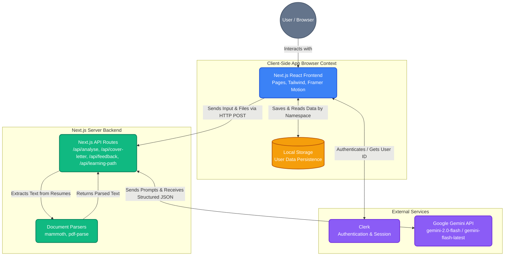
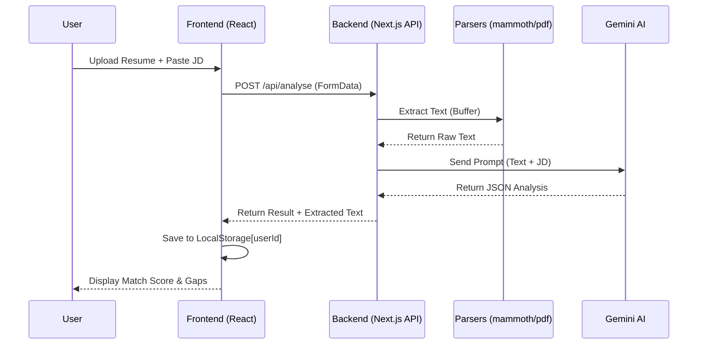
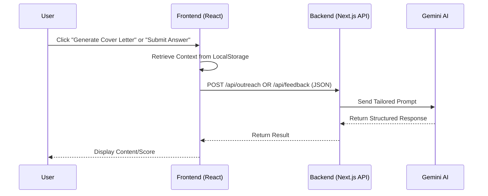

# Application Architecture Design

This document outlines the system architecture of the **Signl** application, reflecting the core platform and the recently added job search automation features.

## Architecture Diagram

## Component Overview

### 1. Frontend (Client-Side)
- **Framework**: Next.js (App Router, React 19) with Tailwind CSS for styling.
- **Interactivity**: Framer Motion for micro-animations and smooth page transitions.
- **Visuals**: Lucide-React for iconography and Recharts for data visualization (funnels, benchmarks).
- **Navigation**: Centrally managed via `src/components/Sidebar.js`.

### 2. State Management & Data Persistence
- **Local Cache**: All user data (profiles, applications, analyses, interview prep, and benchmarks) is stored in the browser's **`localStorage`**.
- **Namespacing**: `src/lib/store.js` uses Clerk's `userId` as a namespace prefix to ensure data privacy if different users log in on the same browser instance.

### 3. Core AI Integration (The Gemini Engine)
- **Primary AI**: Google Gemini API (`@google/generative-ai` SDK).
- **Models**: Uses `gemini-2.0-flash` for high-speed, intelligent processing, with an automatic fallback to `gemini-flash-latest` for maximum reliability.
- **Flow**: API routes act as a secure proxy, providing Gemini with structured context (Resume + JD) and enforcing JSON output schemas.

### 4. Extended Job Search Suite (New Features)
- **Outreach Generator (`/api/cover-letter`)**: Synthesizes resume highlights with job requirements to draft professional cover letters and cold emails.
- **Interview Sandbox (`/api/feedback`)**: Evaluates user practice answers against a 1-10 scale using the STAR method, providing specific improvements and ideal sample responses.
- **Learning Bridge (`/api/learning-path`)**: Automatically creates a curated study plan with external resource links to bridge identified "Skill Gaps" from the Resume Analyser.

### 5. Authentication & Security
- **Clerk**: Handles the entire auth lifecycle. Session management is handled on the server via Clerk middleware, ensuring only authenticated users can access the dashboard and APIs.

## Sequence Diagrams

### 1. Resume Analysis Flow

### 2. Outreach & Interview Feedback Flow

## Data Model (Local Storage)
All data is stored as JSON objects in `localStorage`, namespaced by the user's unique Clerk ID (`signl_{clerk_id}_{type}`).

| Key | Description | Structure |
| :--- | :--- | :--- |
| `profile` | User onboarding info | `{ name, goal, experienceLevel }` |
| `applications` | Tracked job status | `Array<{ id, company, role, stage, date }>` |
| `analyses` | AI Match results | `Array<{ id, resumeText, jdText, matchScore, gaps, coachInsight }>` |
| `preps` | Interview sessions | `Array<{ id, company, role, questions: [] }>` |
| `benchmarks` | Market data pulse | `{ salary, demand, competition }` |
