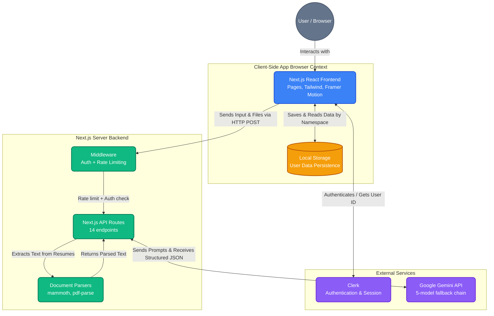
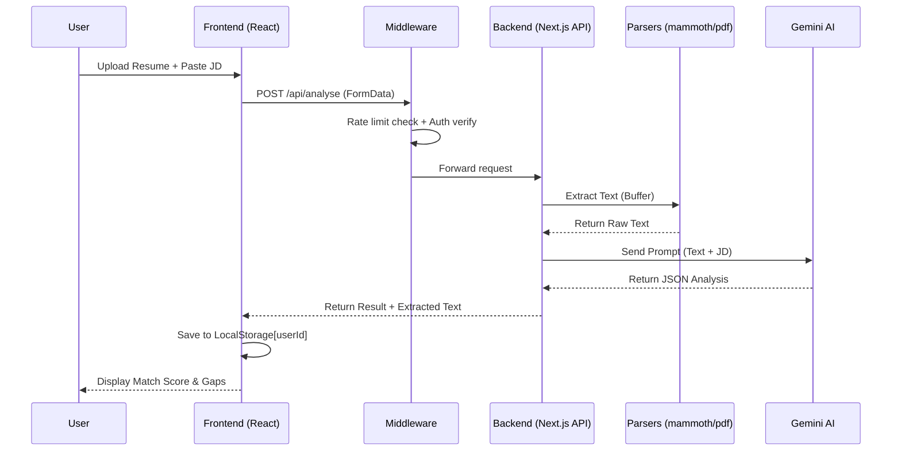
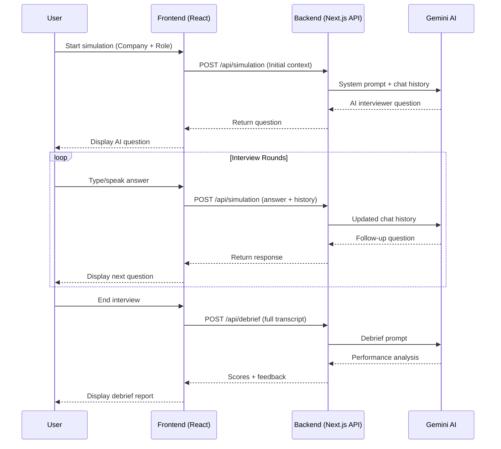
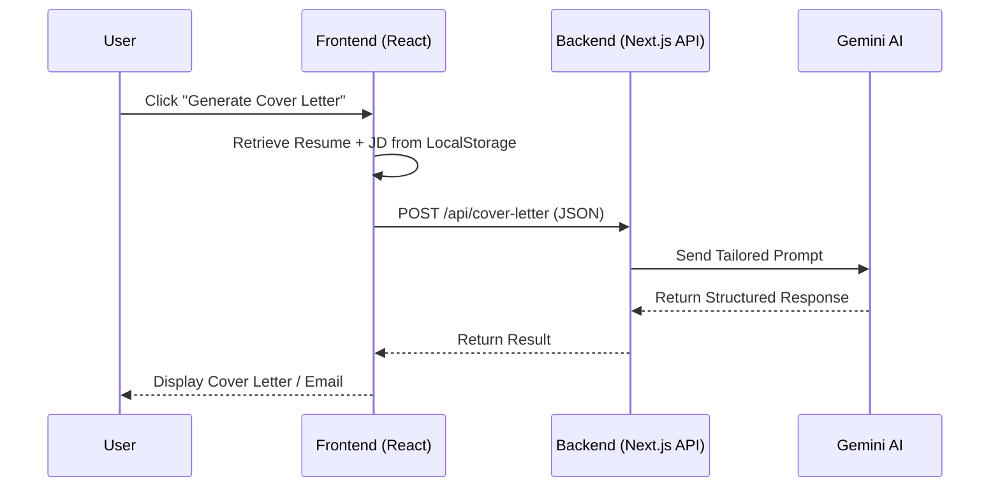

# Application Architecture Design

This document outlines the system architecture of the **Signl** application — an AI-powered career intelligence platform built on Next.js with Google Gemini integration.

---

## Architecture Diagram

```mermaid
graph TD
    %% Styling Definitions
    classDef frontend fill:#3b82f6,stroke:#1d4ed8,stroke-width:2px,color:white,rx:8px,ry:8px
    classDef backend fill:#10b981,stroke:#047857,stroke-width:2px,color:white,rx:8px,ry:8px
    classDef storage fill:#f59e0b,stroke:#b45309,stroke-width:2px,color:white,rx:8px,ry:8px
    classDef external fill:#8b5cf6,stroke:#6d28d9,stroke-width:2px,color:white,rx:8px,ry:8px
    classDef user fill:#64748b,stroke:#475569,stroke-width:2px,color:white,rx:20px,ry:20px

    User((User / Browser)):::user

    subgraph Client [Client-Side App Browser Context]
        UI[Next.js React Frontend<br/>Pages, Tailwind, Framer Motion]:::frontend
        Store[(Local Storage<br/>User Data Persistence)]:::storage
    end

    subgraph Server [Next.js Server Backend]
        MW[Middleware<br/>Auth + Rate Limiting]:::backend
        API[Next.js API Routes<br/>14 endpoints]:::backend
        Parsers[Document Parsers<br/>mammoth, pdf-parse]:::backend
    end

    subgraph Ext [External Services]
        Clerk[Clerk<br/>Authentication & Session]:::external
        Gemini[Google Gemini API<br/>5-model fallback chain]:::external
    end

    %% Relationships and Flows
    User -->|Interacts with| UI
    
    UI <-->|Authenticates / Gets User ID| Clerk
    UI <-->|Saves & Reads Data by Namespace| Store
    UI -->|Sends Input & Files via HTTP POST| MW
    MW -->|Rate limit + Auth check| API
    
    API -->|Extracts Text from Resumes| Parsers
    Parsers -->|Returns Parsed Text| API
    
    API <-->|Sends Prompts & Receives Structured JSON| Gemini
```

---

## Component Overview

### 1. Frontend (Client-Side)
- **Framework**: Next.js 16 (App Router) with React 19 and Tailwind CSS 4 for styling.
- **Typography**: Mulish (via `next/font`) for app chrome; Inter (via Google Fonts) for the landing page.
- **Interactivity**: Framer Motion for micro-animations, page transitions, 3D tilt cards, and scroll-reveal effects.
- **Visuals**: Lucide React for iconography, Recharts for data visualization (funnels, benchmarks), Monaco Editor for code/resume previews.
- **Navigation**: Centrally managed via `src/components/Sidebar.js` with 5 grouped sections (Overview, Applications, AI Prep, Growth, System).
- **Theming**: Dark/light mode via `next-themes` with a custom `ThemeProvider` and `ThemeToggle` component.

### 2. State Management & Data Persistence
- **Local Cache**: All user data (profiles, applications, analyses, interview prep, benchmarks, DNA, and resumes) is stored in the browser's **`localStorage`**.
- **Namespacing**: `src/lib/store.js` uses Clerk's `userId` as a namespace prefix (`signl_{userId}_{type}`) to ensure data privacy across user sessions.
- **No External Database**: The architecture intentionally avoids a traditional database. All persistence is client-side, making the app lightweight and self-contained.

### 3. AI Engine (Gemini Integration)
- **Primary AI**: Google Gemini API (`@google/generative-ai` SDK).
- **Fallback Chain**: 5 models in priority order: `gemini-2.5-flash` → `gemini-2.5-pro` → `gemini-2.0-flash` → `gemini-3-flash-preview` → `gemini-3.1-pro-preview`. If one fails (404, 429, quota), the next is tried automatically.
- **Two Modes**:
  - `generateWithFallback()` — Single-turn prompt → response (used for analysis, benchmarks, cover letters).
  - `generateChatWithFallback()` — Multi-turn chat with history (used for simulations, interviews, debrief).
- **JSON Enforcement**: API routes enforce JSON output schemas in prompts. Responses are parsed through `robustParseJSON()` which handles markdown code blocks, trailing commas, and extraction from mixed text.

### 4. API Endpoints (14 Routes)

| Route | Purpose | AI Mode |
| :--- | :--- | :--- |
| `/api/analyse` | Resume vs. JD gap analysis | Single-turn |
| `/api/extract-text` | PDF/DOCX text extraction | N/A (parser) |
| `/api/cover-letter` | Cover letter / cold email generation | Single-turn |
| `/api/feedback` | Interview answer evaluation (STAR) | Single-turn |
| `/api/prep` | Interview question generation | Single-turn |
| `/api/simulation` | Full mock interview conversation | Multi-turn |
| `/api/debrief` | Post-interview debrief analysis | Single-turn |
| `/api/benchmarks` | Market salary/demand data | Single-turn |
| `/api/jobs` | Resume-based job matching | Single-turn |
| `/api/learning-path` | Skill gap study plan creation | Single-turn |
| `/api/tailor` | Resume tailoring suggestions | Single-turn |
| `/api/insight` | AI coaching insight generation | Single-turn |
| `/api/turbo` | Fast-track analysis mode | Single-turn |
| `/api/debug-models` | Dev utility: test model availability | N/A |

### 5. Authentication & Security
- **Clerk**: Handles the entire auth lifecycle — sign-up, sign-in, session tokens, and user metadata.
- **Middleware**: `middleware.js` runs on every request:
  1. **Rate Limiting** (API routes): Sliding-window, 6 requests/minute per IP.
  2. **Auth Protection**: Non-public routes require a valid Clerk session.
- **Public Routes**: `/`, `/sign-in(.*)`, `/sign-up(.*)` are accessible without authentication.

### 6. Billing & Feature Gating
- **Tiers**: Free, Pro, Team (stored in localStorage).
- **Free Limits**: 20 applications, 3 analyses, 1 interview prep session.
- **Hook**: `useBilling()` custom hook provides reactive access to plan status and feature gates.

---

## Sequence Diagrams

### 1. Resume Analysis Flow

```mermaid
sequenceDiagram
    participant U as User
    participant F as Frontend (React)
    participant MW as Middleware
    participant B as Backend (Next.js API)
    participant P as Parsers (mammoth/pdf)
    participant G as Gemini AI

    U->>F: Upload Resume + Paste JD
    F->>MW: POST /api/analyse (FormData)
    MW->>MW: Rate limit check + Auth verify
    MW->>B: Forward request
    B->>P: Extract Text (Buffer)
    P-->>B: Return Raw Text
    B->>G: Send Prompt (Text + JD)
    G-->>B: Return JSON Analysis
    B-->>F: Return Result + Extracted Text
    F->>F: Save to LocalStorage[userId]
    F-->>U: Display Match Score & Gaps
```

### 2. Mock Interview Simulation Flow

```mermaid
sequenceDiagram
    participant U as User
    participant F as Frontend (React)
    participant B as Backend (Next.js API)
    participant G as Gemini AI

    U->>F: Start simulation (Company + Role)
    F->>B: POST /api/simulation (Initial context)
    B->>G: System prompt + chat history
    G-->>B: AI interviewer question
    B-->>F: Return question
    F-->>U: Display AI question

    loop Interview Rounds
        U->>F: Type/speak answer
        F->>B: POST /api/simulation (answer + history)
        B->>G: Updated chat history
        G-->>B: Follow-up question
        B-->>F: Return response
        F-->>U: Display next question
    end

    U->>F: End interview
    F->>B: POST /api/debrief (full transcript)
    B->>G: Debrief prompt
    G-->>B: Performance analysis
    B-->>F: Scores + feedback
    F-->>U: Display debrief report
```

### 3. Cover Letter & Outreach Flow

```mermaid
sequenceDiagram
    participant U as User
    participant F as Frontend (React)
    participant B as Backend (Next.js API)
    participant G as Gemini AI

    U->>F: Click "Generate Cover Letter"
    F->>F: Retrieve Resume + JD from LocalStorage
    F->>B: POST /api/cover-letter (JSON)
    B->>G: Send Tailored Prompt
    G-->>B: Return Structured Response
    B-->>F: Return Result
    F-->>U: Display Cover Letter / Email
```

---

## Data Model (Local Storage)

All data is stored as JSON objects in `localStorage`, namespaced by the user's unique Clerk ID (`signl_{clerk_id}_{type}`).

| Key | Description | Structure |
| :--- | :--- | :--- |
| `profile` | User onboarding info | `{ name, goal, experienceLevel }` |
| `plan` | Subscription tier | `"free" \| "pro" \| "team"` |
| `resume` | Centralized resume text | `{ text, fileName, updatedAt }` |
| `applications` | Tracked job applications | `Array<{ id, company, role, stage, date, createdAt }>` |
| `analyses` | AI match results | `Array<{ id, resumeText, jdText, matchScore, gaps, coachInsight }>` |
| `preps` | Interview prep sessions | `Array<{ id, company, role, questions: [] }>` |
| `benchmarks` | Market data insights | `{ salary, demand, competition }` |
| `dna` | Communication DNA profile | `{ strengths, weaknesses, patterns }` |

---

## Security Considerations

1. **API Key Protection**: The Gemini API key is server-side only (`process.env.GEMINI_API_KEY`), never exposed to the client.
2. **Auth Middleware**: All non-public routes are protected by Clerk's session verification.
3. **Rate Limiting**: 6 requests/minute per IP prevents brute-force API abuse.
4. **Data Isolation**: localStorage namespacing ensures users cannot access each other's data on shared browsers.
5. **No PII in AI Prompts**: Resume text is sent for analysis but not stored on external servers beyond the API call.
